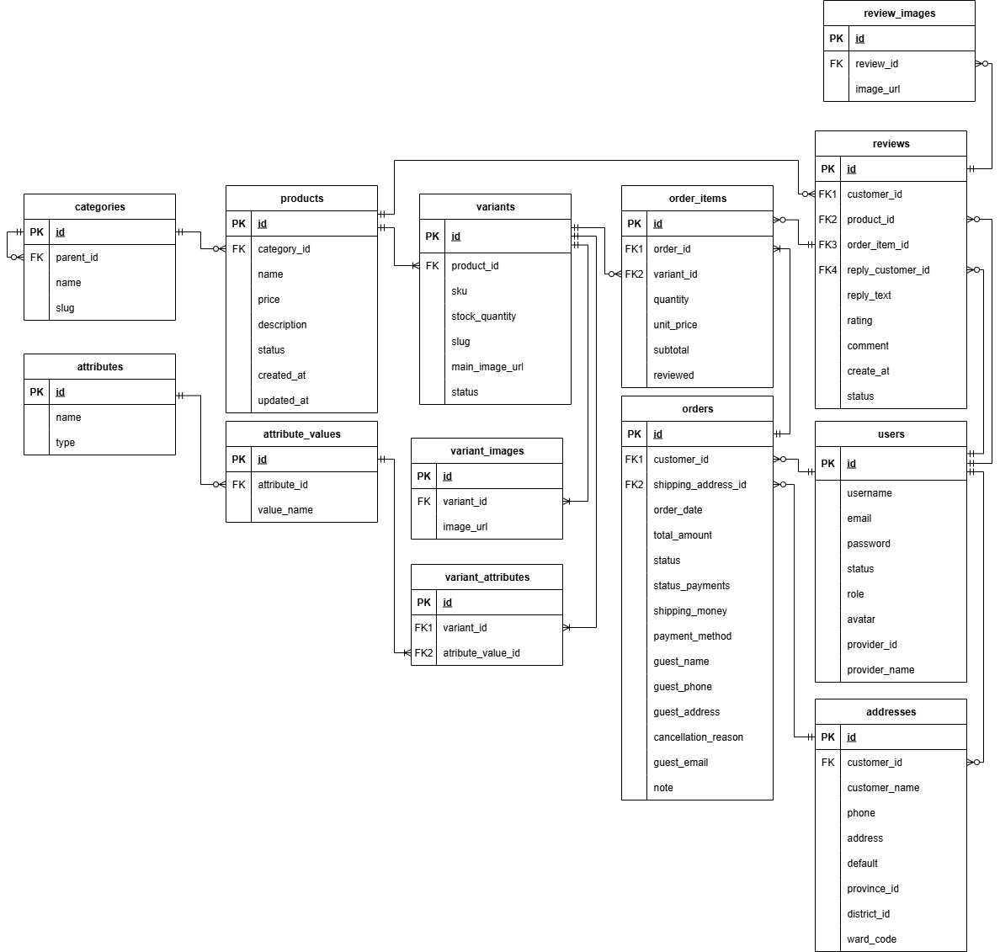
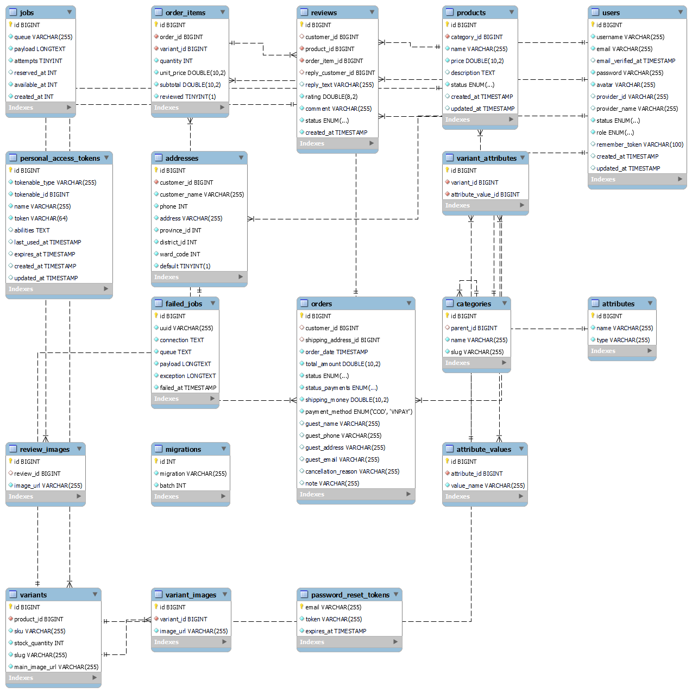

# 🛍️ Giới thiệu dự án SHOPGRID

## 📌 Mô tả

* **ShopGrid** là một website bán hàng cơ bản, được thực hiện trong quá trình học và rèn luyện kỹ năng lập trình web. Giao diện và bố cục được tham khảo từ website  **MBL** , sau đó được tối ưu và xây dựng lại để phù hợp với mục tiêu học tập.

## 🗂️ Cấu trúc dự án

Dự án được chia thành 2 phần chính:

* **Backend** : API được phát triển bằng  **Laravel** cung cấp dữ liệu cho frontend.
* **Frontend** : Giao diện web được xây dựng bằng  **VueJS**

## ⚙️ Công nghệ & Dịch vụ hỗ trợ

* **Laravel** : Framework PHP phát triển backend và API.
* **VueJS** : Framework frontend hiện đại, dễ dàng mở rộng và quản lý.
* **MySQL (phpMyAdmin)** : Hệ quản trị cơ sở dữ liệu quan hệ, lưu trữ thông tin sản phẩm, đơn hàng, tài khoản.
* **Cloudinary** : Lưu trữ và quản lý hình ảnh sản phẩm, hỗ trợ upload ảnh nhanh chóng.
* **Pusher** : Dùng cho một vài tính năng cần real-time (trạng thái đơn hàng)
* **VNPay** : Tích hợp cổng thanh toán online, giúp người dùng có thể thanh toán trực tiếp qua website.
* **GHN** : Tích hợp api tính phí ship và chọn địa chỉ.
* **Queue (Laravel queue:work)** : Sử dụng để xử lý tác vụ gửi email nền (ví dụ: gửi OTP, thông báo khi đặt hàng) giúp hệ thống hoạt động mượt mà, không bị chậm.

## ✨ DEMO

## ✨ Các tính năng

### Chức năng dành cho Khách hàng

* Người dùng có thể  **đăng nhập/đăng ký** , khôi phục mật khẩu và quản lý tối đa 3 địa chỉ nhận hàng.
* Xem **danh sách sản phẩm** với các bộ lọc: mới, bán chạy, đánh giá cao, theo danh mục hoặc theo giá.
* Xem **chi tiết sản phẩm** và thêm **các biến thể** (màu sắc, kích cỡ) vào giỏ hàng.
* Thực hiện **đặt hàng** với tài khoản hoặc khách vãng lai; hỗ trợ thanh toán COD hoặc online qua  **VNPay** .
* Thay đổi **địa chỉ nhận hàng** và **hủy đơn hàng** khi cần thiết và hệ thống cho phép.
* **Đánh giá sản phẩm** sau khi đơn hàng hoàn tất.
* Nhận **email thông báo tự động** về đơn hàng thông qua  **queue:work** .

### Chức năng dành cho Quản trị viên

* **Quản lý sản phẩm** : thêm, chỉnh sửa (bao gồm biến thể), ẩn sản phẩm; quản lý các biến thể sản phẩm.
* **Quản lý đơn hàng** : cập nhật trạng thái đơn hàng theo tiến trình xử lý, in hoá đơn PDF
* **Quản lý thuộc tính sản phẩm** : thêm, sửa, xoá các thuộc tính chưa liên kết với biến thể hoặc đơn hàng.
* **Quản lý đánh giá** : Trả lời đánh giá của khách hàng, duyệt đánh giá.
* **Quản lý danh mục** : thêm, sửa, xoá danh mục (chỉ khi không có danh mục con và sản phẩm).
* **Quản lý người dùng** : phân quyền và quản lý tài khoản manager, staff và customer; khoá tài khoản khách hàng khi cần.
* **Thống kê** : doanh thu, trạng thái đơn hàng theo ngày/tháng/năm, tỷ lệ đánh giá, top khách hàng, top 5 sản phẩm bán chạy, sản phẩm tồn kho và cảnh báo.### DEMO

## ✨ ERD - Database Diagram





## 🚀 Hướng dẫn cài đặt & chạy dự án

### 1. Yêu cầu môi trường

* **PHP** : Phiên bản 8.1 trở lên.
* **Composer** : Để quản lý các gói của Laravel.
* **Node.js** : Phiên bản 14 trở lên.
* **Cơ sở dữ liệu** : MySQL hoặc MariaDB.
* **Web Server** : Nginx hoặc Apache.

### 2. Hướng dẫn cài đặt

Thực hiện các bước bổ sung sau khi đã clone repository:

# Clone repository

```
git clone https://github.com/thuytien157/e-commerce.git
```

# Cài đặt Backend (Server)

```
composer install
```

Mở tệp `.env.example`, đổi tên tệp thành `.env`, và điền các thông tin sau:

```
MAIL_MAILER=smtp
MAIL_HOST=smtp.gmail.com
MAIL_PORT=587
MAIL_USERNAME=tieenz.work@gmail.com
MAIL_PASSWORD=pylgdukvuwukcsdi
MAIL_ENCRYPTION=tls
MAIL_FROM_ADDRESS=tieenz.work@gmail.com

PUSHER_APP_ID=thông tin này lấy từ dashboard của Pusher
PUSHER_APP_KEY=thông tin này lấy từ dashboard của Pusher
PUSHER_APP_SECRET=thông tin này lấy từ dashboard của Pusher
PUSHER_HOST=
PUSHER_PORT=443
PUSHER_SCHEME=https
PUSHER_APP_CLUSTER=ap1

GOOGLE_CLIENT_ID=thông tin này lấy từ ggclound
GOOGLE_CLIENT_SECRET=thông tin này lấy từ ggclound
GOOGLE_REDIRECT_URI=url callback được cài đặt từ ggclound

CLOUDINARY_URL=thông tin này lấy từ dashboard của Cloudinary

GHN_TOKEN=thông tin này lấy từ website của ghn
GHN_SHOP_ID=thông tin này lấy từ website của ghn
GHN_FROM_DISTRICT=thông tin này lấy từ website của ghn

VNPAY_IPN_URL=https://5026a5a244c8.ngrok-free.app/api/vnpay-ipn
VNPAY_RETURN_URL=http://127.0.0.1:8000/api/payment-return
FRONTEND_URL=http://localhost:5173
VNPAY_URL=https://sandbox.vnpayment.vn/paymentv2/vpcpay.html
VNPAY_TMN_CODE=IPCSTBMI
VNPAY_HASH_SECRET=S1KAOXRO80OZ85L4HV3RO0OH8T4OBTV
```

* **PUSHER_APP_ID, PUSHER_APP_KEY, PUSHER_APP_SECRET, PUSHER_APP_CLUSTER**: Bạn truy cập `https://dashboard.pusher.com`/ để đăng ký. Sau đó, bạn copy nội dung vào.
* **GOOGLE_CLIENT_ID, GOOGLE_CLIENT_SECRET, GOOGLE_REDIRECT_URI**: Bạn truy cập `https://console.cloud.google.com/` để đăng ký. Sau đó, bạn copy nội dung vào.
* **CLOUDINARY_URL** : Bạn truy cập `https://cloudinary.com` để đăng ký. Sau đó, bạn copy nội dung vào.
* **GHN_TOKEN, GHN_SHOP_ID, GHN_FROM_DISTRICT**: Bạn truy cập `https://khachhang.ghn.vn/` để đăng ký. Sau đó, bạn copy nội dung vào.

Chỉnh sửa file .env để cấu hình database và các dịch vụ khác

```
php artisan migrate --seed
php artisan serve
php artisan queue:work
```

# Cài đặt Frontend (Client)

```
npm install
```

Mở tệp `.env.example`, đổi tên tệp thành `.env`, và điền các thông tin sau:

```
VITE_GHN_TOKEN = thông tin này lấy từ website của ghn
VITE_PUSHER_APP_KEY = thông tin này lấy từ dashboard của Pusher
VITE_PUSHER_APP_CLUSTER = ap1
```

Chỉnh sửa file .env để cấu hình URL API backend

```
npm run dev
```

### 3. Tài khoản thử nghiệm

1. Khách hàng:

```
email: thuytien.hoctap@gmail.com
password: Thuytien965002@
```

2. Người bán:

```
email: thuytien.hoctap@gmail.com
password: Thuytien965002@
```

3. Thanh toán VNPAY:

```
Số thẻ: 9704198526191432198
Tên chủ thẻ:NGUYEN VAN A
Ngày phát hành:07/15
Mật khẩu OTP:123456
```
